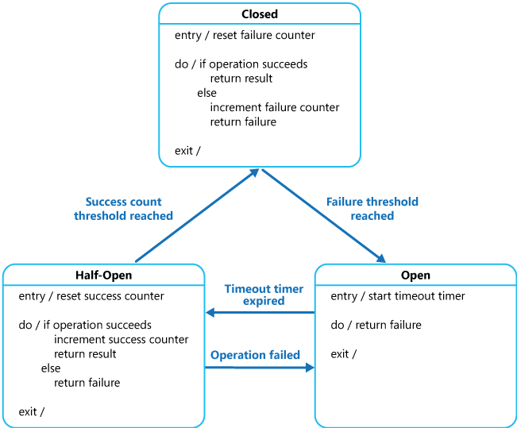

# Design e Arquitetura de Software 1 - 2025/2 Turma B
- Aluno: Thales Pedri

# Bibliografia
- Design patterns https://refactoring.guru/design-patterns/observer
- Clean code https://integrada.minhabiblioteca.com.br/reader/books/9788550816043/pageid/0
- https://engsoftmoderna.info/cap5.html
- https://integrada.minhabiblioteca.com.br/reader/books/9788550819754/epubcfi/6/2%5B%3Bvnd.vst.idref%3Dcover%5D!/4/2/2%4051:1

# Aula 31/07
- Abstração e Complexidade:
É o ato de entender um problema real e representá-lo no código de forma simplificada, focando apenas nos aspectos essenciais para sua resolução.  Isso permite transformar situações do mundo real em estruturas lógicas e funcionais dentro do software, facilitando a construção de sistemas mais claros. Softwares são abstrações de um problema do mundo real, que tendem a serem complexos por esse motivo, e essa complexidade é um problema porque torna o sistema mais difícil de entender, manter e evoluir. Quanto mais complicado o código, mais difícil fica para os desenvolvedores entenderem como ele funciona, corrigirem erros, fazerem alterações com segurança e trabalharem em equipe.

- Frameworks: 
Frameworks são conjuntos de ferramentas, bibliotecas e convenções que fornecem uma estrutura pronta para o desenvolvimento de software, facilitando a criação de aplicações ao oferecer soluções já implementadas para problemas comuns, elas são praticemente uma cópia uma das outras e o ideal é se acostumar com pelo menos uma para conseguir ter produtividade, experiência e até um entendimento base para usar outras caso for necessário.

- Padronização de código:
É a prática de seguir convenções uniformes na escrita do código dependendo da linguagem usada, com nome de variaveis e funções padronizadas por exemplo, camelCase (ex: minhaVariavel) ou snake_case (ex: minha_variavel). Isso facilita a leitura, entendimento e manutenção do software, especialmente em equipes, pois todos seguem um mesmo padrão que torna o código mais claro e organizado.

- POO:
A orientação a objetos é a base para tudo, que organiza o código em classes e objetos, com uma estrutura lógica e coesa para o desenvolvimento de software. Esse modelo permite encapsular dados, reutilizar o código e compor sistemas divididos em módulos, facilitando o desenvolvimento em grupos, a manutenção e a escalabilidade, deixando mais organizado por saber o que cada parte realiza.  

- Estrutura de Dados:
A estruturas de dados, como listas, filas, árvores, grafos, e outras são fundamentais para armazenar, acessar e manipular informações de forma eficiente, servindo como base para algoritmos rápidos e sistemas com alta performance, sendo mais utilizado árvores e grafos para aplicações que atendam e suportem milhões de usuarios simultaneamente de empresas como a Google, Amazon entre outras. 

- Ocultação:
Acontece por exemplo, ao esconder a implementação interna de uma função, classe ou módulo, permitindo que outras partes do sistema usem seus recursos sem precisar saber como são por dentro.

- Mais comentários:
 O esperado de um código é que você possa remover uma parte do código e ainda assim fazer com que o sistema nao quebre, podendo evoluir no futuro o sistema sem que ele falhe.

# Aula 04/08
- Getters e Setters:
 São encapsulamentos, e servem para proteger a informação.

- Coesao:
manter uma única responsabilidade por classe ou até método, para fazer com que realize uma única coisa bem feita, utilizado com bom senso torna torna o código mais fácil de entender e manter, sendo coeso.

- Acoplamento: 
É a força da conexão entre duas classes. Alto acoplamento é quando um grupo de classes é altamente dependente umas das outras. E algo com baixo acoplamento é quando os componentes de um sistema têm pouca ou nenhuma dependência um do outro. O ideal é nao ter um alto acoplamento, porque uma mudança em um componente pode exigir modificações em vários outros, dificultando a manutenção, a reutilização e os testes.

Na engenharia de software o ideal é ter um software altamente coeso e com baixo acoplamento.

# Aula 07/08

- SOLID:
É programar orientado a objetos do jeito certo, usar da melhor forma que ela foi pensada para ser utilizada.

  - Single Responsibility Principle: É uma aplicação direta da ideia da coesão, cada parte do seu codigo tem uma unica responsabilidade, ou seja, uma razão para mudar.

  - Open/Closed Principle: Classes, módulos e funções devem estar abertos para extensão, mas fechados para modificação, permitindo adicionar novas funcionalidades sem alterar o código existente.

  - Interface Segregation Principle: Toda comunicação do sistema deveria ter uma interface e cada interface deveria ter uma única responsabilidade, como por exemplo se quiser ver os movimentos do mouse em um botão, teria uma interface para isso da mesma maneira que teria uma interface para os cliques no botão.

  - Dependency Inversion Principle: Módulos de alto nível não devem depender de módulos de baixo nível, ambos devem depender de abstrações (interfaces), invertendo a dependência para tornar o código mais flexível e desacoplado.

# importante
 - Herança (generalização/especialização) → linha sólida com seta aberta apontando para a classe pai.

 - Associação → linha sólida, pode ter seta fechada indicando direção, mostra relacionamento entre classes.

 - Implementação → linha tracejada/vazada com seta aberta apontando para a interface que está sendo implementada.

# Aula 11/08
- Herança: uma classe filha herda atributos e métodos da classe pai. Problema: cria forte acoplamento e pode gerar hierarquias rígidas.
- Composição: em vez de herdar, você combina objetos, reutilizando comportamentos de outras classes.
- Vantagem: dá mais flexibilidade, facilita mudanças e evita dependência desnecessária de uma hierarquia fixa.

- Princípio de Demeter:
  - Uma classe deve conhecer o mínimo possível de outras classes. Em vez de navegar em várias camadas de objetos, uma classe deve interagir apenas com seus colaboradores diretos. Isso reduz acoplamento e facilita a manutenção, porque mudanças em um objeto não se propagam tanto.

    
# Aula 14/08
- SOLID
  - Liskov Substitution Principle: Objetos de uma classe derivada devem poder substituir objetos da classe base sem quebrar o funcionamento do sistema, garantindo que subclasses preservem o comportamento esperado.

  https://login.vitalsource.com/?redirect_uri=https%3A%2F%2Fintegrada.minhabiblioteca.com.br%2Freader%2Fbooks%2F9788577800469%2Fpageid%2F0&brand=integrada.minhabiblioteca.com.br
  https://engsoftmoderna.info/cap6.html
  https://refactoring.guru/design-patterns

# Aula 18/08

- Singleton: É único, só pode haver um dele. A ideia dele é você criar um ponto único global de acesso, como se fosse uma variável global, considerado hoje um anti-pattern.  
  O padrão Singleton garante que uma classe tenha apenas uma instância durante toda a execução do programa e fornece um método de acesso global a essa instância. É útil para gerenciar recursos compartilhados, como conexões com banco de dados ou configurações globais. No entanto, seu uso excessivo pode dificultar testes e aumentar o acoplamento do sistema, por isso deve ser aplicado com cautela.

# Aula 21/08
- Observer:  É um padrão de projeto que define uma relação um-para-muitos entre objetos. Quando o objeto principal muda de estado, todos os objetos dependentes são notificados automaticamente.  
  O padrão Observer é muito utilizado para implementar sistemas de eventos, como interfaces gráficas ou notificações. Ele permite que objetos "observadores" se registrem para receber atualizações de um "observado" (publisher), promovendo baixo acoplamento entre as partes do sistema. Assim, novas funcionalidades podem ser adicionadas facilmente apenas criando novos observadores, sem modificar o código.

  https://refactoring.guru/design-patterns/observer

# Aula 25/08
https://refactoring.guru/design-patterns/observer

# Aula 28/08

- a arquitetura é o esqueleto do software, guiada por princípios e materializada em decisões que garantem que o sistema atenda às suas características desejadas.

https://login.vitalsource.com/?redirect_uri=https%3A%2F%2Fintegrada.minhabiblioteca.com.br%2Freader%2Fbooks%2F9788550819754%2Fepubcfi%2F6%2F18%5B%253Bvnd.vst.idref%253Dcap1.xhtml%5D%21%2F4&brand=integrada.minhabiblioteca.com.br

# Aula 01/09
- Expectativa de um arquiteto:
   - Ser responsável por decisões técnicas de longo prazo. Garantir que a arquitetura atenda requisitos funcionais e não funcionais apoiando a equipe e facilitando a comunicacao tecnica. Tambem espera que o arquiteto se mantenha atualizado acompanhando novas tecnologias, ferramentas e praticas, pois a arquitetura muda com o passar do tempo e novas necessidades. Alem de conhecer tecnologias, tambem deve conhecer o contexto e regras do negócio em que o software está inserido para que as decisoes implementadas tenham maior sucesso.
- Decisões de arquitetura:
  - São as escolhas sobre como o sistema será construído: tecnologias, frameworks, padrões de projeto, etc.
 - DevOps
   -  refere-se à substituição de operações e desenvolvimento em silos. A ideia é criar equipes multidisciplinares que agora trabalham em conjunto com práticas e ferramentas compartilhadas e eficientes, com o objetivo de entregar software de forma mais rápida, confiável e com feedback contínuo.

 integrada.minhabiblioteca.com.br/reader/books/9788550819754/epubcfi/6/18%5B%3Bvnd.vst.idref%3Dcap1.xhtml%5D!/4

# Aula 04/09
- Resuma a diferença entre: Arquitetura e Design:
   - O arquiteto foca na estrutura e em como o sistema irá operar, o designer foca em implementar as soluções arquitetadas, devem trabalhar em conjunto para que não haja problemas de integração e comunicação.
- Como é a formação do conhecimento de um arquiteto modelo T?
  - É quando o artquiteto tem uma profundidade técnica em algumas áreas específicas, sendo a perna do T vertical, mas o mais importante, possui amplitude técnica em várias áreas, que é a barra horizontal do T, permitindo-o entender o contexto geral do projeto e se comunicar, conectar e propor soluções para diferentes equipes do projeto.

https://login.vitalsource.com/?redirect_uri=https%3A%2F%2Fintegrada.minhabiblioteca.com.br%2Freader%2Fbooks%2F9788550819754%2Fepubcfi%2F6%2F22%5B%253Bvnd.vst.idref%253Dcap2.xhtml%5D%21%2F4&brand=integrada.minhabiblioteca.com.br

# Aula 08/09 e 11/09
https://login.vitalsource.com/?redirect_uri=https%3A%2F%2Fintegrada.minhabiblioteca.com.br%2Freader%2Fbooks%2F9788550819754%2Fepubcfi%2F6%2F22%5B%253Bvnd.vst.idref%253Dcap2.xhtml%5D%21%2F4%2F2%2F58%5Bsigil_toc_id_24%5D%2F1%3A22%5B-of%252Cfs%5D&brand=integrada.minhabiblioteca.com.br

- Analise de trade-offs
  - processo de pesar prós e contras de cada decisão arquitetural para escolher a que melhor atende o sistema no determinado contexto.

# Aula 15/09 e 18/09
Implementação do publisher e subscriber (tópico) no codigo.

# 2 BIMESTRE

# Aula 06/10
https://login.vitalsource.com/?redirect_uri=https%3A%2F%2Fintegrada.minhabiblioteca.com.br%2Freader%2Fbooks%2F9788550819754%2Fepubcfi%2F6%2F26%5B%253Bvnd.vst.idref%253Dcap4.xhtml%5D%21%2F4&brand=integrada.minhabiblioteca.com.br

- Características Operacionais da Arquitetura
  - São aspectos relacionados ao comportamento do sistema em tempo de execução, como desempenho, escalabilidade, disponibilidade e confiabilidade.
   - Desempenho: Refere-se à rapidez com que o sistema responde às solicitações dos usuários. Uma boa arquitetura busca minimizar latência e maximizar throughput (quantidade de operações por segundo).
   - Escalabilidade: Capacidade do sistema de crescer e se adaptar ao aumento de carga, seja horizontalmente (adicionando mais máquinas) ou verticalmente (aumentando recursos de uma máquina).
   - Disponibilidade: Medida de quanto tempo o sistema está operacional e acessível aos usuários. Sistemas altamente disponíveis utilizam técnicas como redundância e failover automático para minimizar períodos de inatividade.
   - Confiabilidade: Capacidade do sistema de funcionar corretamente e sem falhas durante um determinado período. Uma arquitetura confiável prevê mecanismos de tolerância a falhas e recuperação automática.
   
 - Características Estruturais da Arquitetura
  - São aspectos relacionados à organização interna do sistema, como modularidade, coesão, acoplamento e separação de preocupações.
   - Modularidade: Refere-se à divisão do sistema em módulos independentes, cada um com responsabilidade única. Uma boa modularidade facilita manutenção, testes e evolução do sistema.
   - Coesão: Mede o quanto os elementos dentro de um módulo estão relacionados entre si. Alta coesão significa que o módulo tem uma única responsabilidade bem definida.
   - Acoplamento: Refere-se ao grau de interdependência entre módulos. Baixo acoplamento é desejável, pois facilita mudanças em um módulo sem afetar outros.
   - Separação de preocupações: Princípio que sugere dividir o sistema em partes que tratam de preocupações diferentes, como regras de negócio, interface e persistência. Isso melhora a organização e clareza do código.
   
 - Características Transversais da Arquitetura
 - São aspectos que afetam toda a aplicação, como segurança, monitoramento, tratamento de erros e conformidade.
   - Segurança: Envolve proteger o sistema contra acessos não autorizados, vazamentos de dados e ataques. Uma boa arquitetura incorpora mecanismos de autenticação, autorização e criptografia desde o início.
   - Monitoramento: Capacidade de observar o comportamento do sistema em tempo real, coletando métricas e logs para identificar problemas e otimizar o desempenho.
   - Tratamento de Erros: Estratégias para lidar com falhas de forma优雅 e controlada, garantindo que o sistema continue funcionando mesmo diante de falhas.
   - conformidade: refere-se à aderência a normas, regulamentos e políticas aplicáveis ao sistema, como leis de privacidade (ex: LGPD) ou padrões de indústria. A arquitetura deve suportar mecanismos para garantir conformidade desde o início do desenvolvimento.
   
  - Arquitetura Menos Pior
   - A"Arquitetura Menos Pior" é uma abordagem pragmática onde, diante de várias opções ruins, escolhe-se a que cause menor impacto negativo ao sistema no contexto específico. Em vez de buscar a solução perfeita (muitas vezes inviável), busca-se a menos problemática, considerando restrições reais como tempo, orçamento e tecnologia disponível.
  
# Aula 09/10
https://integrada.minhabiblioteca.com.br/reader/books/9788550819754/epubcfi/6/26%5B%3Bvnd.vst.idref%3Dcap4.xhtml%5D!/4

 - Circuit Breaker
  - O padrão Circuit Breaker é usado para lidar com falhas temporárias em serviços externos, evitando chamadas repetidas a um serviço que está com problemas. Ele funciona como um disjuntor: quando detecta várias falhas consecutivas, "abre o circuito" e impede chamadas futuras por um tempo. Após esse período, ele entra em um estado de "meio aberto" para testar se o serviço voltou ao normal.
    Ele ajuda a melhorar a resiliência e estabilidade de um sistema distribuído, evitando sobrecarga em serviços já comprometidos.
   - 

# Aula 13/10
https://learn.microsoft.com/en-us/azure/architecture/patterns/cqrs

- CQRS (Command Query Responsibility Segregation)
  - O padrão CQRS propõe a separação das operações de leitura (Query) e escrita (Command) em modelos diferentes, permitindo otimizar cada uma de forma independente. Isso é especialmente útil em sistemas complexos onde as necessidades de leitura e gravação são distintas. Com isso, podemos ter modelos de dados otimizados para consulta e outros para persistência, melhorando desempenho, escalabilidade e manutenibilidade, um dos pontos negativos é ler o mesmo dado em dois lugares diferentes, o que pode gerar inconsistências se não for bem implementado.
  
  

